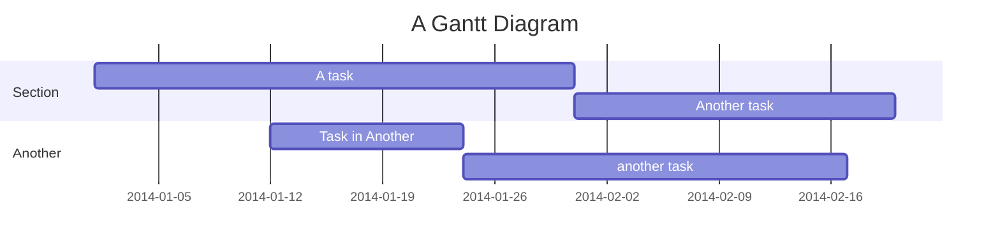

# MANUAL

## Installation

You only need the following dependencies:

- make
- tectonic (or change PDF_ENGINE to your favorite pdf engine)
- pandoc
- mermaid-filter (`npm i -g mermaid-filter`)
- pandoc-crossref
- pandoc-include (`pip install --user pandoc-include`)

## Usage

### Create repo using Github-CLI

```sh
gh repo create [orgname]/[project-name] -p Cavernum/PandocTemplate --clone
```

### Compile document

Make sure you have every dependencies you need.

```sh
make
```

### Markdown basics

```md
# Header 1

## Header 2

### Header 3

Text paragraph. Single newline does are ignored.

eg. "This
sentence
is "
the same as "This sentence is".

- Bullet 1
- Bullet 2
- Bullet 3

1. Element 1
2. Element 2
3. Element 3

`outline`

\```[lang]
snippet
\```

[caption](url) make a link

 include an image

{width=100px} include an image of 100px width

```

### File inclusion

For easier contribution to a document, you may create separated files to avoir conflicts.

The main file will always be `src/main.md`.
If you include other files like `src/example.md`.

```md
!include example.md
```

Make sure you have `include-resources: src` in your file header to make it work properly.

### Mermaid filter



### Crossref

Voici un example d'utilisation de crossref.

```md
{#fig:myfig}

@fig:myfig reference the image above

\```{#fig:myschema .mermaid}
gantt
    title A Gantt Diagram
    dateFormat YYYY-MM-DD
    section Section
        A task          :a1, 2014-01-01, 30d
        Another task    :after a1, 20d
    section Another
        Task in Another :2014-01-12, 12d
        another task    :24d
\```

@fig:myschema

\```{.c @lst:mysnippet}
int main(void) return 0;
\```

@lst:mysnippet

```